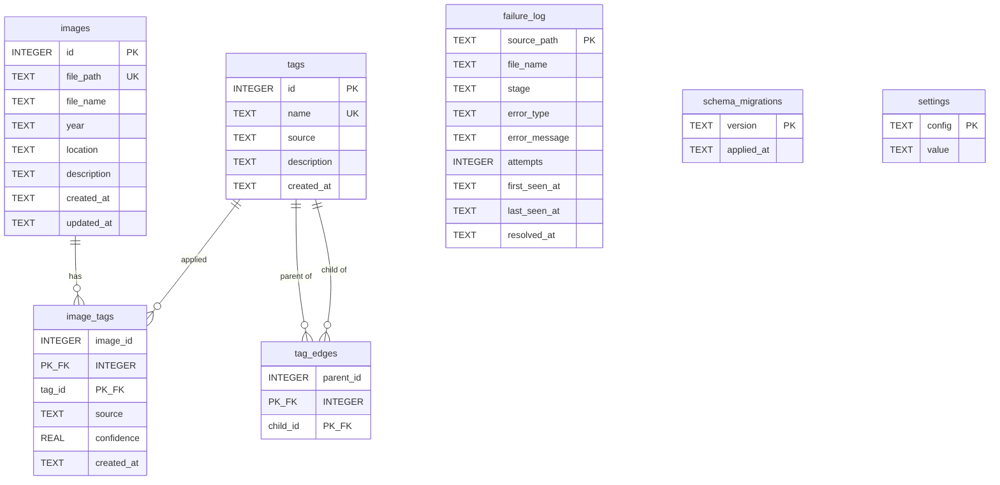

# TagPhy Catalog Schema

Source of truth: SQL files in [`migrations/`](migrations/).
This document describes the schema as defined by those migrations.

## ERD



## Tables

### `images`

One row per catalogued photo after a successful move.

| Column | Type | Constraints | Notes |
|---|---|---|---|
| `id` | INTEGER | PRIMARY KEY AUTOINCREMENT | |
| `file_path` | TEXT | NOT NULL, UNIQUE | Post-move path under `Photo_Tagged/` |
| `file_name` | TEXT | NOT NULL | Basename of the file |
| `year` | TEXT | NOT NULL | Year folder / metadata year |
| `location` | TEXT | DEFAULT `''` | Place string, or empty |
| `description` | TEXT | DEFAULT `''` | Optional image description |
| `created_at` | TEXT | NOT NULL | Row creation timestamp |
| `updated_at` | TEXT | NOT NULL | Row update timestamp |

### `tags`

Tag vocabulary. Names are UNIQUE with SQLite's default (case-sensitive) collation.

| Column | Type | Constraints | Notes |
|---|---|---|---|
| `id` | INTEGER | PRIMARY KEY AUTOINCREMENT | |
| `name` | TEXT | NOT NULL, UNIQUE | Tag label |
| `source` | TEXT | NOT NULL | Origin of the tag (e.g. vision / year / location / manual) |
| `description` | TEXT | DEFAULT `''` | Optional tag description |
| `created_at` | TEXT | NOT NULL | |

### `image_tags`

Many-to-many join between images and tags.

| Column | Type | Constraints | Notes |
|---|---|---|---|
| `image_id` | INTEGER | NOT NULL, FK → `images(id)` ON DELETE CASCADE, PK | |
| `tag_id` | INTEGER | NOT NULL, FK → `tags(id)` ON DELETE CASCADE, PK | |
| `source` | TEXT | NOT NULL, DEFAULT `'vision'` | How this assignment was made |
| `confidence` | REAL | nullable | Optional confidence score |
| `created_at` | TEXT | NOT NULL | |

Primary key: `(image_id, tag_id)`.

### `tag_edges`

Directed acyclic graph edges between tags. Direction is generic parent → more specific child.

| Column | Type | Constraints | Notes |
|---|---|---|---|
| `parent_id` | INTEGER | NOT NULL, FK → `tags(id)` ON DELETE CASCADE, PK | Broader tag |
| `child_id` | INTEGER | NOT NULL, FK → `tags(id)` ON DELETE CASCADE, PK | Narrower tag |

Primary key: `(parent_id, child_id)`.
Check: `parent_id <> child_id` (no self-edges). Longer cycles are not prevented by DDL.

### `failure_log`

One row per source path that failed processing (upsert target).

| Column | Type | Constraints | Notes |
|---|---|---|---|
| `source_path` | TEXT | PRIMARY KEY | Pre-move path of the failed file |
| `file_name` | TEXT | NOT NULL | |
| `stage` | TEXT | NOT NULL | Pipeline stage that failed |
| `error_type` | TEXT | nullable | Exception / error class |
| `error_message` | TEXT | nullable | Detail message |
| `attempts` | INTEGER | NOT NULL, DEFAULT `1` | Attempt counter |
| `first_seen_at` | TEXT | NOT NULL | First failure time |
| `last_seen_at` | TEXT | NOT NULL | Most recent failure time |
| `resolved_at` | TEXT | nullable | Set when resolved, if retained |

### `settings`

Key-value product settings (migration `002_create_settings.sql`). Not for secrets.

| Column | Type | Constraints | Notes |
|---|---|---|---|
| `config` | TEXT | PRIMARY KEY | Setting name (e.g. `privacy_pre_check`) |
| `value` | TEXT | NOT NULL, `CHECK (value <> '')` | Stored as a string (`"true"` / `"false"` for booleans) |

Default row: `privacy_pre_check` = `'true'` (`INSERT OR IGNORE` in the migration; `SettingsStore.load()` also seeds missing defaults).

### `schema_migrations`

Records which migration files have been applied.

| Column | Type | Constraints | Notes |
|---|---|---|---|
| `version` | TEXT | PRIMARY KEY | Migration identifier (filename) |
| `applied_at` | TEXT | NOT NULL | When it was applied |

## Indexes

| Name | Table | Column(s) |
|---|---|---|
| `idx_image_tags_tag` | `image_tags` | `tag_id` |
| `idx_tag_edges_child` | `tag_edges` | `child_id` |
| `idx_images_year` | `images` | `year` |
| `idx_failure_log_open` | `failure_log` | `resolved_at` |

## Descendant query (application use)

Not part of the DDL; shown here because `tag_edges` exists to support it.

```sql
WITH RECURSIVE descendants(id) AS (
    SELECT :tag_id
    UNION
    SELECT e.child_id
    FROM tag_edges e
    JOIN descendants d ON e.parent_id = d.id
)
SELECT DISTINCT i.*
FROM images i
JOIN image_tags it ON it.image_id = i.id
WHERE it.tag_id IN (SELECT id FROM descendants);
```
